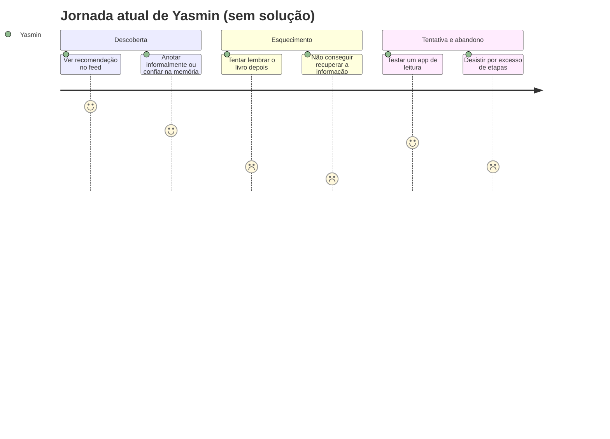

# Cenário de Análise/Problema

> Cenários construídos a partir das dores identificadas em [`3_perfil_usuario.md`](3_perfil_usuario.md) e dos mapas de empatia em [`4_personas.md`](4_personas.md). Nenhuma menção à plataforma que a equipe vai construir — as narrativas descrevem a vida das personas **antes** dela existir.

---

# Parte 1 — Yasmin Duarte (persona primária 1)

## 1) Cenário de Análise/Problema

Yasmin trabalha em regime CLT e, nos poucos momentos livres que sobram entre o trabalho e a vida pessoal, gosta de ler romance e fantasia. Ela descobre a maior parte dos livros que quer ler passando o feed do TikTok e do Instagram — vê uma resenha animada, se interessa, e segue o dia. Às vezes anota o título nas Notas do celular, às vezes só confia na memória mesmo. Semanas depois, quando finalmente tem um tempo livre pra procurar aquele livro, não lembra mais o nome nem onde viu a indicação — só que "tinha uma menina falando super bem de um livro de fantasia". Ela já tentou usar um aplicativo de leitura pra não perder mais esses achados, mas o processo de cadastrar cada livro pedia tantas informações que, depois de duas ou três tentativas, ela desistiu e voltou pras Notas do celular, sem grande disciplina. Hoje, se alguém perguntasse quantos livros ela leu neste ano, ela não saberia responder com certeza.

## 2) Questões de Refinamento

- Isso acontece toda vez que ela vê uma recomendação, ou só em alguns casos?
- Por que ela não registra o livro na hora, assim que vê a recomendação?
- O esquecimento é sempre do nome do livro, ou às vezes também de onde viu a indicação?
- Ela chega a tentar buscar o livro depois, mesmo sem lembrar o nome certo? Como?
- O que a fez desistir do aplicativo que tentou usar — foi um motivo específico ou um acúmulo de pequenas fricções?
- Isso afeta só a descoberta de livros novos, ou também o controle dos livros que ela já está lendo ou já terminou?

## 3) Refinamento do Cenário de Análise/Problema

Yasmin vê recomendações de livros quase todo dia no feed das redes sociais, mas só registra o título quando está com o celular na mão exatamente naquele momento — coisa rara, já que costuma ver essas recomendações em intervalos curtos entre uma tarefa e outra. Quando não anota na hora, o esquecimento é duplo: perde o nome do livro e a lembrança de onde viu a recomendação, o que torna a busca posterior praticamente impossível — ela nem sabe por onde começar a procurar. Da mesma forma, sem um lugar central para isso, ela também perde o controle dos livros que já está lendo ou já terminou, não só dos que quer ler. A tentativa de usar um aplicativo dedicado não foi por um motivo único: foram várias pequenas fricções — muitos campos para preencher, etapas repetitivas — que, somadas à rotina corrida, fizeram o aplicativo parecer "mais trabalho do que ajuda", e ela parou de usar em poucas semanas.

## 4) Contexto de Uso

- Yasmin usa o celular em pausas curtas e fragmentadas do dia — no trajeto para o trabalho, em intervalos entre tarefas, ou à noite antes de dormir — nunca num momento dedicado e tranquilo.
- Contexto social: as recomendações que mais a influenciam vêm de uma comunidade online de leitores (BookTok/Bookstagram), não de amigos próximos necessariamente.
- O problema se intensifica em períodos de maior carga de trabalho, quando ela tem ainda menos tempo para "voltar" e organizar o que viu.
- Ela normalmente está com atenção dividida (rolando o feed enquanto faz outra coisa) no momento exato em que vê a recomendação — o que dificulta ainda mais o registro imediato.
- Dispositivo: majoritariamente o celular; não há rotina de uso de computador para esse fim.

## 5) Jornada do Usuário (atual, sem solução) — Yasmin

| Etapa | O que acontece | Estado emocional |
| :---- | :---- | :---- |
| 1. Descoberta casual | Vê uma recomendação de livro passando o feed do TikTok/Instagram, entre outras tarefas. | Interessada |
| 2. Registro informal (ou ausência dele) | Às vezes anota nas Notas do celular; na maioria das vezes, só confia na memória. | Despreocupada, sem perceber o risco de esquecer |
| 3. Esquecimento | Dias ou semanas depois, tenta lembrar do livro e não consegue recuperar nem o nome nem a origem da recomendação. | Frustrada |
| 4. Tentativa de solução | Baixa um aplicativo de leitura para não perder mais recomendações; encontra um processo de cadastro longo e repetitivo. | Desanimada |
| 5. Abandono | Para de usar o aplicativo em poucas semanas; volta ao improviso das Notas do celular. | Resignada / sem controle sobre a própria leitura |

---

# Parte 2 — Camila Ferreira (persona primária 2)

## 1) Cenário de Análise/Problema

Camila é estudante universitária e também está estagiando. No início do ano, decidiu estabelecer uma meta de ler 20 livros — um jeito de se sentir produtiva mesmo com a rotina corrida entre aulas e estágio. Ela anota os livros que termina nas Notas do celular, mas nem sempre lembra de atualizar na hora. Sempre que alguém pergunta quantos livros ela já leu neste ano, ela precisa parar, abrir as Notas e contar manualmente item por item — e às vezes ainda fica em dúvida se esqueceu de anotar algum. Ela também gostaria de guardar uma nota (de 1 a 5) e uma pequena opinião sobre cada livro, mas isso nunca virou hábito, porque não tem um lugar único e prático pra fazer isso. No fim, ela sente que está perto de bater a meta, mas nunca tem certeza exata — e essa incerteza tira um pouco do prazer de acompanhar o próprio progresso.

## 2) Questões de Refinamento

- Isso acontece só com a contagem da meta, ou ela também perde a lembrança do que achou de cada livro?
- Por que ela não atualiza as Notas assim que termina um livro?
- Ela já tentou algum aplicativo específico para controlar a meta de leitura? O que aconteceu?
- Essa incerteza sobre "quantos faltam para a meta" muda o comportamento dela — por exemplo, escolher livros mais curtos só para "bater o número"?
- Ela compartilha essa meta com alguém, ou é um objetivo só dela?

## 3) Refinamento do Cenário de Análise/Problema

O esquecimento de Camila não se limita à contagem da meta — ela também perde a lembrança do que achou de livros lidos há alguns meses, porque nunca chegou a anotar nota ou opinião no momento certo. Ela não atualiza as Notas na hora porque, ao terminar um livro, normalmente já está voltando para outra obrigação (o estágio, uma aula) e decide "anotar depois" — o que, na prática, acontece com dias de atraso, quando já esqueceu detalhes. Ela nunca chegou a testar um aplicativo específico para controlar metas de leitura; a ideia de ter que aprender e manter mais um aplicativo parece, de antemão, mais trabalho do que vale a pena. A meta de 20 livros é um objetivo pessoal, que ela não compartilha ativamente com ninguém — o que reduz a pressão social, mas também significa que só ela mesma percebe (ou deixa de perceber) se está no caminho certo.

## 4) Contexto de Uso

- Camila costuma atualizar suas anotações de leitura à noite, em casa, depois de voltar do estágio ou das aulas — quase nunca no momento exato em que termina um livro.
- Contexto social: a meta é um compromisso pessoal, sem cobrança externa — ninguém mais sabe o número exato que ela definiu.
- Contexto cultural: sente uma pressão pessoal de "ser produtiva" mesmo fora do trabalho e dos estudos, e a leitura acaba entrando nessa métrica pessoal de desempenho.
- O problema fica mais evidente em momentos de reflexão — fim de mês, quando alguém pergunta quantos livros ela já leu, ou quando ela mesma para para pensar no ano.
- Dispositivo: celular (Notas); não há uso de computador para esse fim.

## 5) Jornada do Usuário (atual, sem solução) — Camila

| Etapa | O que acontece | Estado emocional |
| :---- | :---- | :---- |
| 1. Definição da meta | Decide, no início do ano, estabelecer a meta de ler 20 livros. | Motivada |
| 2. Leitura no dia a dia | Lê nas poucas janelas livres entre estágio e faculdade. | Concentrada |
| 3. Registro adiado | Termina um livro, mas decide "anotar depois"; frequentemente atrasa ou esquece. | Despreocupada, momentaneamente |
| 4. Tentativa de conferir o progresso | Alguém pergunta quantos livros já leu; ela precisa contar manualmente nas Notas. | Insegura |
| 5. Incerteza persistente | Não tem certeza se contou tudo certo, nem lembra da opinião que tinha sobre alguns livros. | Frustrada / sem sensação de conquista |

---

# Parte 3 — Letícia Ramos (persona secundária)

## 1) Cenário de Análise/Problema

Letícia divide a rotina entre trabalho e estudos, e nos poucos minutos livres — no ônibus, entre uma tarefa e outra — lê pelo Kindle. Ela gosta das sugestões automáticas do próprio aparelho, que aparecem baseadas no que já leu, e não perde muito tempo procurando o que ler a seguir. Há um tempo, decidiu também usar um aplicativo separado para acompanhar estatísticas mais completas da sua leitura, já que o Kindle sozinho não mostra tudo o que ela gostaria de ver. Só que o aplicativo trava com frequência e às vezes desconecta no meio do uso. Depois de várias tentativas frustradas de manter os dois atualizados — o Kindle automaticamente e o app manualmente —, ela foi, aos poucos, parando de anotar no app. Hoje, ela sabe o que está lendo agora, mas não tem mais uma visão completa de tudo o que já leu ao longo do ano; essa parte ficou perdida entre um sistema que funciona sozinho e outro que ela abandonou.

## 2) Questões de Refinamento

- O travamento do aplicativo acontece sempre que ela abre, ou só em alguns momentos/situações?
- O que a levou a tentar um segundo aplicativo, se o Kindle já dava conta de sugerir livros?
- Ela chegou a tentar outro aplicativo depois desse, ou desistiu de vez da ideia?
- Ela sente falta das estatísticas que perdeu, ou já se acostumou a não ter esse dado?
- O problema é só técnico (instabilidade do app), ou também envolve o esforço de manter dois lugares atualizados ao mesmo tempo?
- Ela pagaria por uma solução mais estável, ou espera algo gratuito e simples?

## 3) Refinamento do Cenário de Análise/Problema

O travamento do aplicativo que Letícia tentou usar não é um problema ocasional — acontece com frequência suficiente para que ela associe o app à ideia de "não funciona direito", o que a levou a, aos poucos, parar de abri-lo. Ela decidiu experimentar esse segundo aplicativo porque queria ver estatísticas anuais (quantos livros, quais gêneros) que o Kindle não apresenta de forma clara — o dispositivo é ótimo para sugerir o próximo livro, mas fraco para mostrar uma visão consolidada do ano. Depois da experiência frustrada, ela não chegou a testar um segundo aplicativo concorrente — simplesmente desistiu da ideia de ter esse dado. Ainda sente falta das estatísticas, mas hoje avalia que não vale o esforço de tentar de novo sem ter certeza de que vai funcionar. O problema é tanto técnico (instabilidade) quanto de esforço duplicado — manter dois sistemas atualizados ao mesmo tempo (um automático, outro manual) parece mais trabalho do que o benefício que traz.

## 4) Contexto de Uso

- Letícia lê principalmente pelo Kindle (aplicativo ou dispositivo dedicado) durante o trajeto de transporte público e em pausas entre trabalho e estudo.
- Contexto tecnológico relevante: uso frequente em trânsito, o que pode incluir conexão de internet instável. **Hipótese (não verificada nas entrevistas)**: esse fator pode estar relacionado à instabilidade percebida no aplicativo concorrente, mas isso não foi confirmado diretamente por Letícia.
- Contexto social: pouco guiada por recomendações de terceiros nesse processo específico — depende mais do histórico dentro do próprio e-reader do que de indicações externas.
- O problema (perda da visão consolidada da leitura) fica mais evidente em momentos pontuais, como quando ela tenta lembrar quantos livros leu no ano ou quer revisitar algo que já leu.
- Dispositivo: Kindle como leitor principal; celular como onde o aplicativo concorrente foi instalado e abandonado.

## 5) Jornada do Usuário (atual, sem solução) — Letícia

| Etapa | O que acontece | Estado emocional |
| :---- | :---- | :---- |
| 1. Leitura via Kindle | Lê no Kindle e recebe sugestões automáticas de próximos livros baseadas no histórico. | Satisfeita, confiante no dispositivo |
| 2. Busca por mais dados | Percebe que quer ver estatísticas anuais que o Kindle não mostra bem; instala um app concorrente para isso. | Esperançosa |
| 3. Frustração técnica | O app trava e desconecta repetidamente ao tentar usá-lo. | Irritada |
| 4. Esforço duplicado | Tenta, por um tempo, manter Kindle e app atualizados ao mesmo tempo. | Sobrecarregada |
| 5. Abandono parcial | Para de atualizar o app; mantém só o Kindle, mas perde a visão consolidada do ano. | Resignada, com uma lacuna de dados que sente falta |

