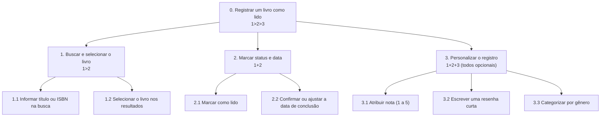
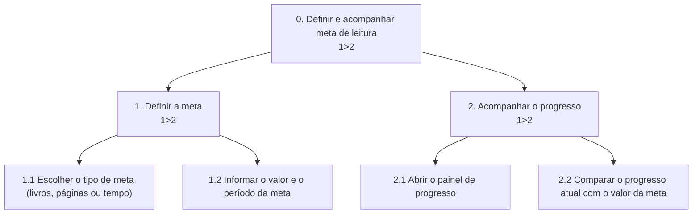

# Análise de Tarefas

> Modelagem de 4 funcionalidades centrais do produto, escolhidas por serem as mais citadas nas dores das personas primárias (Yasmin e Camila) e da persona secundária (Letícia) em [`4_personas.md`](4_personas.md) e [`5_cenarios.md`](5_cenarios.md): registrar um livro lido, definir/acompanhar uma meta de leitura, avaliar/resenhar um livro, e sincronizar o progresso com o Kindle.

---

## HTA — Registrar um livro como lido

**Funcionalidade**: permitir que o usuário busque um livro, marque-o como lido e, se quiser, personalize o registro com nota, resenha ou categoria — sem que essas etapas extras sejam obrigatórias. Modelada com foco na dor de Yasmin (Segmento A), que abandona apps quando o cadastro exige muitas informações.



- **Plano 0 (`1>2>3`)**: primeiro busca e seleciona o livro, depois marca status e data, e só então (se quiser) personaliza o registro — nessa ordem.
- **Plano 1 (`1>2`)**: só é possível selecionar um resultado depois de realizar a busca.
- **Plano 2 (`1+2`)**: marcar como lido e confirmar a data acontecem no mesmo passo do formulário, em qualquer ordem.
- **Plano 3 (1+2+3, todos opcionais)**: os três itens de personalização (nota, resenha e categoria) podem ser preenchidos em qualquer ordem e são todos opcionais — o usuário pode preencher nenhum, um, dois ou os três, sem que isso bloqueie salvar o registro. Essa é a etapa que, no cenário de Yasmin, precisa continuar sendo pulável — é o que a fez abandonar o aplicativo concorrente que testou.

---

## HTA — Definir e acompanhar uma meta de leitura

**Funcionalidade**: permitir que o usuário defina uma meta de leitura (por número de livros, páginas ou tempo) e acompanhe seu progresso comparado ao valor definido. Modelada com foco na dor de Camila (Segmento B), que estabelece uma meta mas perde a exatidão de quanto já cumpriu.



- **Plano 0 (`1>2`)**: a meta precisa existir antes de haver progresso a comparar.
- **Plano 1 (`1>2`)**: só é possível informar o valor da meta depois de escolher o tipo (o campo muda conforme a escolha: número de livros, número de páginas ou horas).
- **Plano 2 (`1>2`)**: abrir o painel é pré-requisito para visualizar a comparação com a meta.

---

## GOMS — Avaliar e escrever uma resenha de um livro

**Funcionalidade**: permitir que o usuário registre uma nota (1 a 5) e, opcionalmente, uma resenha em texto sobre um livro já lido. Modelada a partir da dor mais citada nas entrevistas depois de "falta de tempo": o desejo de registrar opinião pessoal além do status "lido" (E2, E3, E5 — ver `3_perfil_usuario.md`, Seção 3).

```
GOAL 0: registrar uma avaliação para o livro "X"

  GOAL 1: chegar até a tela de avaliação do livro

    METHOD 1.A: acessar pela estante de livros lidos
    (SEL. RULE: o livro já foi marcado como lido anteriormente e o usuário está navegando pela estante)
      OP. 1.A.1: tocar na aba "Lidos"
      OP. 1.A.2: localizar o livro "X" na lista
      OP. 1.A.3: tocar no livro para abrir os detalhes
      OP. 1.A.4: tocar em "Avaliar"

    METHOD 1.B: acessar direto pela confirmação de leitura concluída
    (SEL. RULE: o usuário acabou de marcar o livro "X" como lido agora mesmo)
      OP. 1.B.1: tocar em "Avaliar agora" na tela de confirmação de leitura

  GOAL 2: informar a nota
    OP. 2.1: tocar no número de estrelas correspondente (1 a 5)

  GOAL 3: registrar a resenha

    METHOD 3.A: escrever uma resenha em texto
    (SEL. RULE: o usuário deseja registrar uma opinião em texto sobre o livro)
      OP. 3.A.1: tocar no campo de resenha
      OP. 3.A.2: digitar o texto da resenha
      OP. 3.A.3: tocar em "Salvar"

    METHOD 3.B: pular a resenha
    (SEL. RULE: o usuário só quer registrar a nota, sem escrever nada)
      OP. 3.B.1: tocar em "Salvar" sem preencher o campo de resenha
```

---

## GOMS — Sincronizar o progresso de leitura com o Kindle

**Funcionalidade**: permitir que o usuário conecte sua conta Kindle à plataforma e importe automaticamente o progresso de leitura, evitando manter dois sistemas separados. Modelada a partir da dor central de Letícia (Segmento C), que abandonou um app concorrente por ter que atualizar Kindle e app manualmente ao mesmo tempo (ver `5_cenarios.md`, Parte 3).

```
GOAL 0: sincronizar o progresso de leitura com a conta do Kindle

  GOAL 1: conectar a conta do Kindle à plataforma

    METHOD 1.A: conectar pela tela de configurações
    (SEL. RULE: é a primeira vez que o usuário faz essa sincronização)
      OP. 1.A.1: tocar em "Configurações"
      OP. 1.A.2: tocar em "Conectar conta Kindle"
      OP. 1.A.3: informar e-mail e senha da conta Amazon
      OP. 1.A.4: confirmar a autorização de acesso

    METHOD 1.B: pular a conexão, pois já está feita
    (SEL. RULE: o usuário já conectou a conta Kindle em uma sessão anterior)
      OP. 1.B.1: verificar que o status "Conectado" já aparece em Configurações

  GOAL 2: importar o progresso atual
    OP. 2.1: tocar em "Sincronizar agora"
    OP. 2.2: aguardar a confirmação de que a importação foi concluída
```

---

## Síntese

As 4 funcionalidades modeladas cobrem as três personas do projeto: registrar um livro lido e definir/acompanhar metas atendem diretamente Yasmin e Camila (personas primárias); avaliar/resenhar reforça uma dor citada por múltiplas entrevistadas independente do segmento; e sincronizar com o Kindle atende especificamente Letícia (persona secundária). Em todos os HTA e GOMS, o cuidado recorrente foi manter **etapas opcionais realmente puláveis** (Plano 3 do primeiro HTA, Método 3.B do primeiro GOMS) — decisão de design diretamente rastreável à queixa mais repetida na pesquisa: abandono de apps por excesso de etapas obrigatórias de cadastro.
